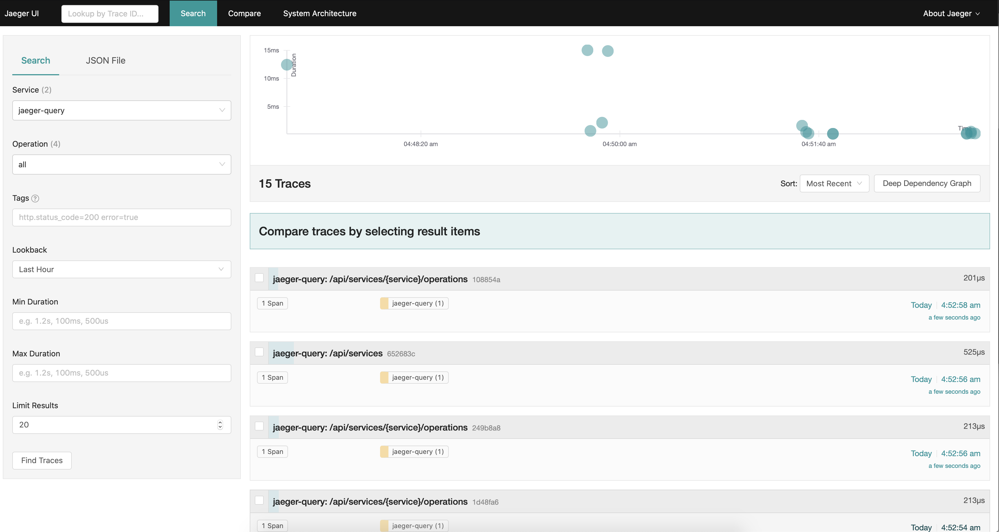
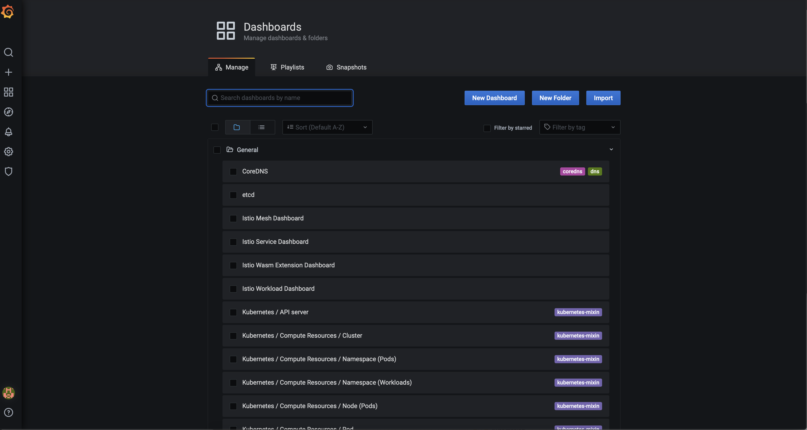
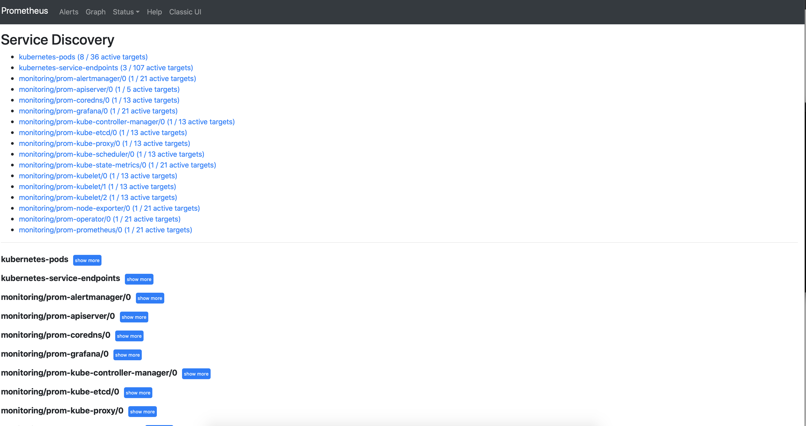
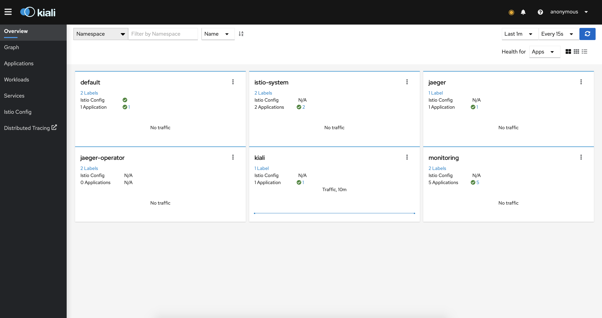

## Microservice Architecture
### Тема: Service mesh на примере Istio.
#### Задание №4:

Развернуть в кластере две версии приложения и настроить балансировку трафика между ними

Цель:
- Развернуть Minikube
- Развернуть Istio c Ingress gateway
- Развернуть две версии приложения с использованием Istio
- Настроить балансировку трафика между версиями приложения на уровне Gateway 50% на 50%
- Сделать снимок экрана с картой сервисов в Kiali с примеров вызова двух версии сервиса

Инструкция к заданию и его описание находится по ссылке https://github.com/izhigalko/otus-homework-istio

------------------------------------------------------------------

### Примечания по решению:

### Зависимости

- [Minikube 1.17.1](https://github.com/kubernetes/minikube/releases/tag/v1.17.1)
- [Kubectl 1.20.2](https://github.com/kubernetes/kubectl/releases/tag/v0.20.3)
- [Istioctl 1.9.0](https://github.com/istio/istio/releases/tag/1.9.0) (brew install istioctl)
- [Heml 3.5.2](https://github.com/helm/helm/releases/tag/v3.5.2)

### Запуск Kubernetes

```shell script
minikube start --cpus=4 --memory=8g --vm-driver=hyperkit --cni=flannel --kubernetes-version="v1.19.0" --extra-config=apiserver.enable-admission-plugins=NamespaceLifecycle,LimitRanger,ServiceAccount,DefaultStorageClass,DefaultTolerationSeconds,NodeRestriction,MutatingAdmissionWebhook,ValidatingAdmissionWebhook,ResourceQuota,PodPreset --extra-config=apiserver.authorization-mode=Node,RBAC
```

Создать неймспейсы для операторов:

```shell script
kubectl apply -f namespaces.yaml
```

### Разворачиваем Jaeger

Jaeger - решение трассировки. Компоненты Istio, такие как: sidecar-контейнер, gateway, отправляют данные запросов в систему. Таким образом получается полная трассировка запроса.

Добавить репозиторий в Helm:
```shell script
helm repo add jaegertracing https://jaegertracing.github.io/helm-charts
helm repo update
```

Установить оператор, разворачивающий Jaeger, и развернуть Jaeger:
```shell script
helm install --version "2.19.0" -n jaeger-operator -f jaeger/operator-values.yaml jaeger-operator jaegertracing/jaeger-operator
kubectl apply -f jaeger/jaeger.yaml
```
Проверить состояние Jaeger:
```shell script
kubectl get po -n jaeger -l app.kubernetes.io/instance=jaeger
```

Открыть web-интерфейс Jaeger:
```shell script
minikube service -n jaeger jaeger-query-nodeport
```


### Разворачиваем Prometheus

Prometheus - система мониторинга. С помощью неё собираются метрики Service mesh.

Добавить репозиторий в Helm:
```shell script
helm repo add prometheus-community https://prometheus-community.github.io/helm-charts
helm repo add stable https://charts.helm.sh/stable
helm repo update
```

Развернуть решение по мониторингу на основе Prometheus:
```shell script
helm install --version "13.7.2" -n monitoring -f prometheus/operator-values.yaml prometheus prometheus-community/kube-prometheus-stack
```

Проверить состояние компонентов мониторинга:
```shell script
kubectl get po -n monitoring
```

Добавить сервис типа NodePort для прямого доступа к Prometheus и Grafana:
```shell script
kubectl apply -f prometheus/monitoring-nodeport.yaml
```

Открыть web-интерфейс Grafana:
```shell script
minikube service -n monitoring prometheus-grafana-nodeport
```


Открыть web-интерфейс Prometheus:
```shell script
minikube service -n monitoring prom-prometheus-nodeport
```



### Разворачиваем Istio

Istio - Service mesh решение для облачных платформ, использующее Envoy.

Установить оператор, разворачивающий Istio, и развернуть Istio c помощью оператора:
```shell script
istioctl operator init --watchedNamespaces istio-system --operatorNamespace istio-operator
kubectl apply -f istio/istio.yaml
```

Проверить состояние Istio:
```shell script
kubectl get all -n istio-system -l istio.io/rev=default
```

### Устанавливаем Kiali

Kiali - доска управления Service mesh

Добавить репозиторий в Helm и установить Kiali Operator, разворачивающий Kiali:
```shell script
helm repo add kiali https://kiali.org/helm-charts
helm repo update
```

Установить Kiali Operator, разворачивающий Kiali, и развернуть Kiali
```shell script
helm install --version "1.29.1" -n kiali-operator kiali-operator kiali/kiali-operator
kubectl apply -f kiali/kiali.yaml
```

Проверить состояние Kiali:
```shell script
kubectl get po -n kiali -l app.kubernetes.io/name=kiali
```

Открыть web-интерфейс Kiali:
```shell script
minikube service -n kiali kiali-nodeport
```



### Развернуть приложение

```shell script
kubectl apply -f app/my-app.yaml
kubectl apply -f app/istio-settings.yaml
```